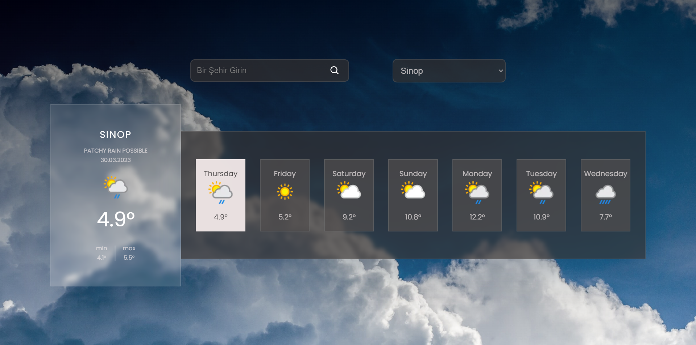
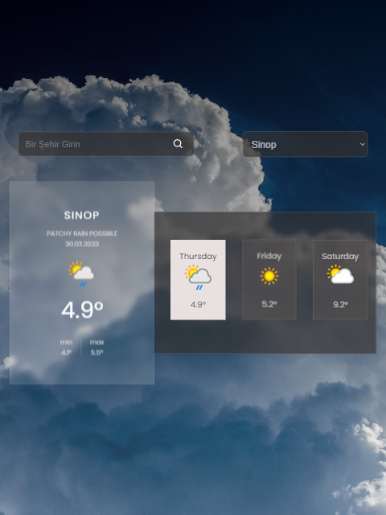
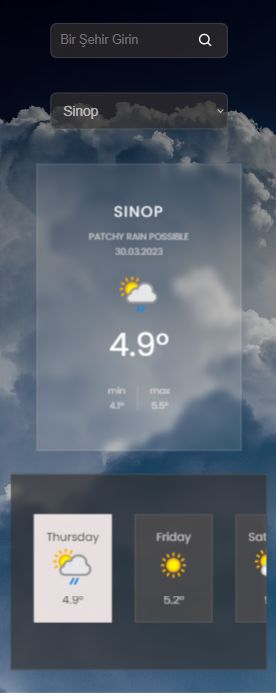

## Weather App

[www.patika.dev](www.patika.dev) task-3 Context Api Weather App


A weather application has been developed in this project using [WeatherApi](www.weatherapi.com)


[Click To Review](https://weather-app-context-api-patika.vercel.app/)


## Project features
* Provides weather information based on the user's location
* 7-day updated weather forecast.
* Search input allows you to search for any city.
* You can access the provinces in Turkey from the select section.
* Responsive desing

## Getting Started
First of all, sign up on https://www.weatherapi.com/ and get an API key and clone project and setup dependencies
```
npm i
```
Navigate to the project folder and run the command 
```
npm run start
```

### Website Images

<hr/>
<br/>


<br/>

<br/>

