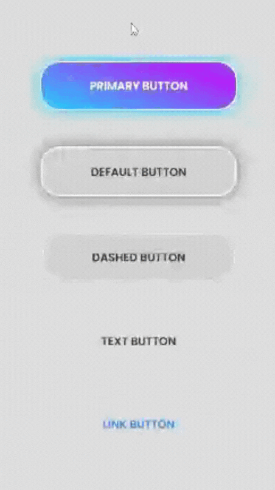

# gradientui

[Package link](https://www.npmjs.com/package/gradientui)

> patika.dev task-5

[](https://www.npmjs.com/package/gradientui) [](https://standardjs.com)

## Install

```bash
npm install gradientui
```

## Usage

```jsx
import React from 'react'
import { Button } from 'gradientui'
import 'gradientui/dist/index.css'

const App = () => {
  return (
    <>
      <Button text={'Primary Button'} type={'primary'} />
      <Button text={'Default Button'} type={'default'} />
      <Button text={'Dashed Button'} type={'dashed'} />
      <Button text={'Text Button'} type={'text'} />
      <Button text={'Link Button'} type={'link'} />
    </>
  )
}
```

## License

MIT © [atifsimsek](https://github.com/atifsimsek)

## View

<br/>


